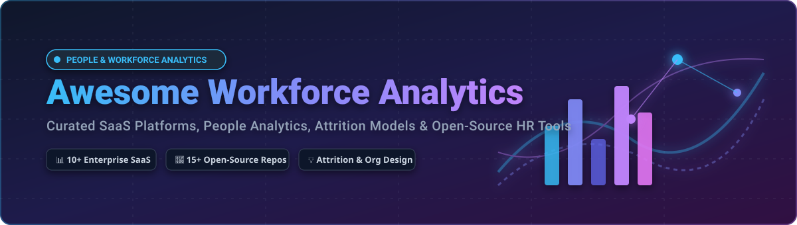

# 📊 Awesome Workforce Analytics

  

  
  
  
  
  

## 🚀 Top Workforce Analytics Tools & People Intelligence Ecosystem
**Curated List of SaaS Products & Open-Source GitHub Projects for HR & People Analytics**  
*Focused on People Analytics, Workforce Insights, Attrition Prediction, Pay Equity, Headcount Planning & Organizational Intelligence*  
**Last updated: August 2026**

This repository tracks notable **SaaS platforms** and **open-source projects** for **Workforce Analytics Tools**. These tools unify HRIS, payroll, engagement, and operational workplace data to deliver headcount insights, attrition risk models, pay equity compliance, organizational design, productivity analytics, and predictive workforce planning.

---

## 📑 Table of Contents
- [🏢 SaaS / Hosted Platforms](#-saas--hosted-platforms)
- [💻 Open-Source GitHub Projects](#-open-source-github-projects)
- [🛠️ Frameworks for Building Custom HR Analytics](#%EF%B8%8F-frameworks-for-building-custom-hr-analytics)
- [🤝 How to Contribute](#-how-to-contribute)
- [⚠️ Disclaimer](#%EF%B8%8F-disclaimer)
- [⭐ Star History](#-star-history)

---

## 🏢 SaaS / Hosted Platforms

Below is a comparative breakdown of top commercial SaaS workforce analytics and HR intelligence platforms, sorted in **descending order by company size** (market capitalization or estimated enterprise valuation/revenue):

| Product Name | Description | Starting Tier / Pricing | Free Tier / Trial Limits | Company Size / Market Valuation |
| :--- | :--- | :--- | :--- | :--- |
| **[Microsoft Viva Insights](https://www.microsoft.com/en-us/microsoft-viva/insights)** 📈 | Productivity and wellbeing analytics within Microsoft 365 / Viva that surfaces collaboration patterns, focus time, and organizational network insights. | Starts at $4.00 per user/month (standalone) or $9.00 per user/month (Viva Suite) | Personal insights included free with M365 Enterprise; 60-day free trial for premium team insights | **~$3.1 Trillion** Market Cap (Microsoft) |
| **[Workday People Analytics](https://www.workday.com/)** 🏢 | Native people analytics and machine-learning insights embedded within the Workday HCM suite for governed workforce intelligence. | HCM platform pricing starts at ~$35–$50 per employee/month (billed annually) | No free trial or free plan (enterprise HCM suite add-on module) | **~$68 Billion** Market Cap (Workday) |
| **[Peakon (Workday Peakon Employee Voice)](https://www.workday.com/)** 🗣️ | Continuous employee listening and engagement analytics platform that combines sentiment with HCM data for retention and culture insights. | Starts at ~$3.50–$4.50 per employee/month (billed annually) | 14-day guided trial available upon request via Workday sales | Acquired for **$700 Million** (Workday) |
| **[Visier](https://www.visier.com/)** 📊 | Enterprise people analytics platform with AI-powered insights (Vee), benchmarking, predictive modeling, and governed workforce reporting at scale. | Starts at ~$15,000/year (Visier Essentials plan) | 30-day free trial (full sandbox access, no credit card required) | **~$1.0 Billion+** Valuation (Unicorn) |
| **[ChartHop](https://www.charthop.com/)** 🗺️ | Organization management and people analytics platform featuring live org charts, headcount planning, compensation, and workforce visibility. | Starts at $4–$8 per employee/month ($9,000/year contract minimum) | Free for teams up to 150 employees (ChartHop Basic); 14-day free trial for paid features | **~$300 Million** Valuation |
| **[Syndio](https://www.syndio.com/)** ⚖️ | Pay equity and compensation analytics platform helping organizations identify, analyze, and remediate pay gaps with audit-ready reporting. | Custom enterprise subscription starting at ~$20,000–$40,000/year | No free forever plan or self-serve trial; free 2-hour pay equity audit session on request | **~$200 Million** Valuation |
| **[One Model](https://www.onemodel.co/)** ⚡ | People data cloud and analytics platform focused on data integration, modeling flexibility, and exporting insights into existing BI stacks. | Enterprise plans starting at ~$30,000–$50,000/year (custom quote-based) | No free forever plan; custom demo environment sandbox available upon request | **~$150 Million** Valuation |
| **[Orgvue](https://www.orgvue.com/)** 📐 | Organizational design and workforce planning platform for analyzing current structures, modeling future states, and monitoring change. | Custom enterprise pricing starting at ~$25,000–$50,000/year | No standard free trial; offers a free 2-hour interactive workforce optimization workshop | **~$100 Million** Est. Valuation / ~$40M Revenue |
| **[Crunchr](https://www.crunchr.com/)** 🔍 | Self-service workforce analytics and planning solution with pre-built HR data models, dashboards, and explainable insights for HR teams. | Custom enterprise plans starting at ~$10,000–$25,000/year | No free forever plan; guided interactive demo & custom pilot sandbox available upon request | **~$30 Million** Est. Valuation |
| **[Worklytics](https://www.worklytics.co/)** ⏱️ | Collaboration and productivity analytics platform that turns digital workplace signals into actionable workforce insights while protecting privacy. | Starts at $2,500/month (billed annually, includes up to 200 users) | Free forever plan available for up to 100 users (with standard calendar signal integrations) | **~$15 Million** Est. Valuation |

---

## 💻 Open-Source GitHub Projects

This section features active open-source projects for self-hosting, HR data pipelines, attrition modeling, and open people-analytics dashboards. Sorted in **descending order by GitHub star counts**:

- **[Apache Superset](https://github.com/apache/superset)**   
  Modern enterprise data exploration and visualization platform widely used for building scalable, custom HR & people-analytics dashboards on top of data warehouses.

- **[Odoo](https://github.com/odoo/odoo)**   
  Open-source suite of business apps, including comprehensive HR modules (Employees, Recruitment, Time Off, Appraisals, and Workforce Reporting).

- **[Metabase](https://github.com/metabase/metabase)**   
  Simple, open-source business intelligence tool that allows non-technical HR managers to run queries and build custom workforce analytics reports effortlessly.

- **[ERPNext](https://github.com/frappe/erpnext)**   
  Open-source ERP framework with built-in Human Resource Management (HRMS) covering payroll, attendance, employee lifecycle, and workforce analytics.

- **[DataEase](https://github.com/dataease/dataease)**   
  Open-source BI and data visualization platform (Tableau alternative) tailored for drag-and-drop workforce and HR analytics dashboards.

- **[OrangeHRM](https://github.com/orangehrm/orangehrm)**   
  Popular open-source HRIS platform providing modular employee management, leave management, performance evaluation, and basic HR reporting.

- **[IceHrm](https://github.com/gamonoid/icehrm)**   
  Open-source human resource management tool for managing employee info, attendance, leave requests, payroll processing, and organizational charts.

- **[OpenSteer](https://github.com/steerlabs/opensteer)**   
  Open-source employee engagement and performance management software alternative focused on continuous feedback and people insights.

- **[WorkforceIntelligence](https://github.com/BigDataProject8/WorkforceIntelligence)**   
  HR analytics platform that predicts employee attrition with lead time, identifies flight-risk factors, and provides survival analysis dashboards.

- **[hr-attrition-analytics](https://github.com/Munishx01/hr-attrition-analytics)**   
  End-to-end people analytics project with attrition prediction models, workforce dashboards covering salary bands, tenure cohorts, and overtime impact.

- **[Pulse HR](https://github.com/davide97g/pulse-hr)**   
  Open-source people-first HR workspace with recognition, growth tracking, vibe heatmaps, and self-hosted people insights.

- **[ai-hr-analytics](https://github.com/kasidit-wansudon/ai-hr-analytics)**   
  AI-powered HR analytics platform (Laravel + Vue + Python ML) featuring turnover prediction, attendance anomaly detection, and RAG chatbot.

- **[hr-analytics-pipeline](https://github.com/Weinasii/hr-analytics-pipeline)**   
  Production-oriented HR data analytics pipeline with ETL, KPI engine, attrition prediction model, and interactive Streamlit dashboard.

- **[PersonalAnalytics](https://github.com/HASEL-UZH/PersonalAnalytics)**   
  Privacy-protecting open-source self-monitoring tool that collects computer interaction data and supports personal productivity analytics research.

- **[Workseed](https://github.com/sjdpk/workseed)**   
  Self-hosted HRM solution with employee management, attendance, leave, org structure, and built-in reports & analytics modules.

- **[hr-analytics-hub](https://github.com/Sohila-Khaled-Abbas/hr-analytics-hub)**   
  Serverless HR analytics SPA that processes uploaded datasets in-memory, generates interactive dashboards, and includes AI-powered insights.

---

## 🛠️ Frameworks for Building Custom HR Analytics
Combine open-source building blocks to construct tailored internal people analytics platforms:
- **Data Modeling & Storage**: **dbt** + **PostgreSQL** / **DuckDB** for clean HR data pipelines and transformation.
- **Machine Learning & Predictive Risk**: **scikit-learn** / **XGBoost** / **SHAP** for attrition prediction, salary equity modeling, and flight-risk explanation.
- **Visual Dashboards**: **Streamlit** / **DataEase** / **Metabase** / **Apache Superset** for interactive workforce insights.
- **Real-Time Operational Signals**: **InfluxDB** + **Grafana** for productivity and collaboration metrics tracking.
- **AI Assistants**: **Ollama** or local LLMs for natural-language workforce querying and automated HR reporting.

---

## 🤝 How to Contribute
1. Fork the repository.
2. Add/edit entries in [`README.md`](file:///C:/Users/ishan/Documents/Projects/Awesome-Workforce-Analytics/README.md) keeping correct sorted order (descending by company valuation/size for SaaS, and descending by star count for Open-Source).
3. Include: name, link, star badge (for open-source), 1–2 sentence description, and accurate pricing/trial/valuation data.
4. Submit a Pull Request with a brief summary of additions.

---

## ⚠️ Disclaimer
- This is a **community-curated** list — not exhaustive and not an endorsement of any product or service.
- Workforce analytics tools handle sensitive personal employee data and must strictly comply with privacy regulations (GDPR, CCPA, etc.) and labor laws.
- Self-hosted open-source solutions require proper access control security, data governance, and algorithmic fairness auditing.

---

## ⭐ Star History

<a href="https://www.star-history.com/?repos=ishandutta2007%2FAwesome-Workforce-Analytics&type=date&legend=bottom-right">
<picture>
<source media="(prefers-color-scheme: dark)" srcset="https://api.star-history.com/chart?repos=ishandutta2007/Awesome-Workforce-Analytics&type=date&theme=dark&legend=bottom-right" />
<source media="(prefers-color-scheme: light)" srcset="https://api.star-history.com/chart?repos=ishandutta2007/Awesome-Workforce-Analytics&type=date&legend=bottom-right" />

</picture>
</a>

---
**Made for HR leaders, people analytics teams, people ops, researchers, and workforce technologists.**  
Let's make workforce analytics more open, data-driven, and equitable! 🚀
